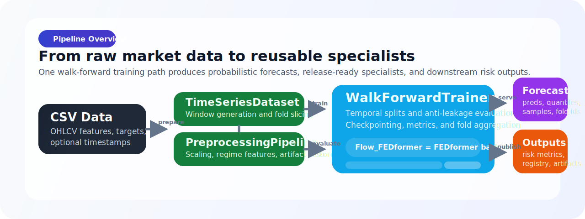

<div align="center">


# FEDformer Probabilistic Time-Series Forecasting

[](LICENSE)
[](https://github.com/RubenPanero/FEDformer-Probabilistic-Time-Series-Forecasting/actions/workflows/compatibility.yml)
[](https://github.com/RubenPanero/FEDformer-Probabilistic-Time-Series-Forecasting/actions/workflows/ci.yml)
[](https://github.com/RubenPanero/FEDformer-Probabilistic-Time-Series-Forecasting/actions/workflows/compatibility.yml)
[](https://github.com/RubenPanero/FEDformer-Probabilistic-Time-Series-Forecasting/actions/workflows/ruff.yml)
[](https://github.com/RubenPanero/FEDformer-Probabilistic-Time-Series-Forecasting/actions/workflows/pylint.yml)
[](https://github.com/RubenPanero/FEDformer-Probabilistic-Time-Series-Forecasting/actions/workflows/security.yml)

Probabilistic forecasting built around `FEDformer`, `Normalizing Flows`,
walk-forward validation, conformal calibration, specialist export, and Optuna.

[Quick Start](#quick-start) • [Training](#training) • [Inference](#inference) • [Testing](#testing-and-ci)

</div>


## Overview

Source-first probabilistic forecasting for tabular time series, built around a
`FEDformer` backbone plus a flow-based probabilistic head.

What you get:

- calibrated uncertainty bands and quantiles
- sampling-based scenario generation
- anti-leakage temporal validation
- repeatable inference from saved specialists
- finance-oriented evaluation such as Sharpe, Sortino, drawdown, VaR, and CVaR

## Repository Snapshot

| Surface | Current state |
| --- | --- |
| Example datasets in `data/` | `NVDA_features.csv`, `GOOGL_features.csv` |
| Canonical specialist distribution | GitHub Release assets for `NVDA`, `GOOGL` |
| Public CLIs | `main.py`, `tune_hyperparams.py`, `python -m inference`, `python -m data.financial_dataset_builder` |
| Supported CI matrix | Linux and Windows, Python 3.10 and 3.11 |
| Runtime modes | CPU and optional CUDA |
| Dev quality gates | Ruff, Pylint, pytest, hook-backed regression checks |

## Visual Reference

All visuals below come from the published `NVDA` specialist and use the same
documentation asset set under `docs/assets/`.

| Forecast band | Calibration diagnostics |
| --- | --- |
| `p10-p90` interval, `p50` median path, and ground truth. | Reliability view plus PIT histogram for probabilistic quality checks. |
|  |  |

> No hosted demo is provided. The intended path is local: fetch the published
> specialists, run inference, then run training or Optuna search as needed.

## Quick Start

The commands below assume `python` resolves to the active environment. On some
Linux or macOS setups, replace `python` with `python3`.

### 1. Clone the repository

```bash
git clone https://github.com/RubenPanero/FEDformer-Probabilistic-Time-Series-Forecasting.git
cd FEDformer-Probabilistic-Time-Series-Forecasting
```

### 2. Create and activate a virtual environment

Linux or macOS:

```bash
python -m venv .venv-linux
source .venv-linux/bin/activate
python -m pip install --upgrade pip
python -m pip install -r requirements.txt
```

Windows PowerShell:

```powershell
python -m venv .venv-win
.venv-win\Scripts\Activate.ps1
python -m pip install --upgrade pip
python -m pip install -r requirements.txt
```

### 3. Optional developer tooling

`ruff` and `pylint` are used by CI and hooks, but they are not installed by
`requirements.txt`.

```bash
python -m pip install ruff pylint
```

### 4. Sanity checks

```bash
python -m pytest -q --collect-only
python main.py --help
python tune_hyperparams.py --help
python -m inference --help
python -m data.financial_dataset_builder --help
```

### 5. Download canonical specialists

```bash
python scripts/fetch_specialists.py --all
```

### 6. Inspect available specialists

```bash
python -m inference --list-models
```

### 7. Run a first inference job

```bash
python -m inference \
  --ticker NVDA \
  --csv data/NVDA_features.csv \
  --output results/inference_nvda.csv
```

> [!NOTE]
> Canonical specialists are distributed as GitHub Release assets, not committed
> to the Git history. `python scripts/fetch_specialists.py --all` downloads the
> current published artifacts, validates their `sha256`, and installs them
> under `checkpoints/`. Inference is a real model run, not a near-instant CLI
> smoke check.

## Architecture

<div align="center">
  
</div>

The pipeline is organized around one core training path that produces
probabilistic forecasts, reusable canonical specialists, and downstream risk
artifacts from the same walk-forward evaluation loop.

Core modules:

| Path | Responsibility |
| --- | --- |
| `main.py` | Training, walk-forward evaluation, metrics, result writing, canonical export |
| `config.py` | `FEDformerConfig`, grouped settings, presets |
| `models/` | FEDformer backbone and flow layers |
| `training/` | Trainer, scheduling, checkpoints, `ForecastOutput` |
| `data/` | Datasets, preprocessing, market dataset builder |
| `inference/` | Specialist loading and prediction CLI |
| `simulations/` | Risk and portfolio simulation |
| `utils/` | Metrics, plotting, calibration, registry helpers |
| `scripts/` | Automation, validation, hook installers |
| `tests/` | Pytest suite |

## Training

### Canonical training run: NVDA

```bash
python main.py \
  --csv data/NVDA_features.csv \
  --targets Close \
  --seq-len 96 \
  --pred-len 20 \
  --batch-size 64 \
  --splits 4 \
  --return-transform log_return \
  --metric-space returns \
  --gradient-clip-norm 0.5 \
  --seed 7 \
  --save-results \
  --save-canonical \
  --no-show
```

### Canonical training run: GOOGL

```bash
python main.py \
  --csv data/GOOGL_features.csv \
  --targets Close \
  --seq-len 96 \
  --pred-len 20 \
  --batch-size 64 \
  --splits 4 \
  --return-transform log_return \
  --metric-space returns \
  --gradient-clip-norm 0.5 \
  --seed 7 \
  --save-results \
  --save-canonical \
  --no-show
```

### Custom dataset example

Use this pattern for your own CSV instead of relying on repository-specific
sample files:

```bash
python main.py \
  --csv path/to/your_timeseries.csv \
  --targets Close \
  --date-col date \
  --seq-len 96 \
  --label-len 48 \
  --pred-len 24 \
  --e-layers 3 \
  --d-layers 1 \
  --n-flow-layers 4 \
  --flow-hidden-dim 64 \
  --dropout 0.1 \
  --epochs 15 \
  --batch-size 64 \
  --splits 5 \
  --use-checkpointing \
  --learning-rate 1e-4 \
  --weight-decay 1e-5 \
  --scheduler-type cosine \
  --seed 123 \
  --deterministic \
  --save-results \
  --no-show
```

> [!TIP]
> In headless environments, set `MPLBACKEND=Agg` before running plotting
> commands.

## Hyperparameter Search

```bash
python tune_hyperparams.py \
  --csv data/NVDA_features.csv \
  --n-trials 8 \
  --n-splits 4 \
  --storage-path optuna_studies/nvda_smoke.db \
  --study-objective sharpe
```

Current public search controls include:

- `seq_len`
- `pred_len`
- `batch_size`
- `gradient_clip_norm`
- `e_layers`
- `d_layers`
- `n_flow_layers`
- `flow_hidden_dim`
- `label_len`
- `dropout`

The Optuna entrypoint defaults to `--compile-mode none`, which avoids compile
overhead during trial subprocesses.

## Inference

The public inference surface is the `inference` module:

```bash
python -m inference --list-models
python -m inference --ticker NVDA --csv data/NVDA_features.csv
python -m inference --ticker NVDA --csv data/NVDA_features.csv --output results/preds.csv
python -m inference --ticker NVDA --csv data/NVDA_features.csv --plot --output-dir results/
```

Inference notes:

- canonical inference expects a model registered in `checkpoints/model_registry.json`
- preprocessing is restored from saved artifacts and must not be re-fit
- default plot outputs are written under the selected `--output-dir`
- the default inference registry is `checkpoints/model_registry.json`

## Data

### Current repository data surface

The public repo currently keeps only these example datasets under `data/`:

- `data/NVDA_features.csv`
- `data/GOOGL_features.csv`

### Expected CSV shape

Expected inputs:

- one date or timestamp column
- one or more numeric feature columns
- one or more target columns selected with `--targets`

Typical financial columns:

- `Date`
- `Open`
- `High`
- `Low`
- `Close`
- `Volume`

Example:

```csv
date,Close,Volume,VIX
2024-01-02,100.5,1000000,13.2
2024-01-03,101.2,1200000,13.7
```

### Build a dataset with yfinance

```bash
python -m data.financial_dataset_builder --symbol NVDA --output_dir data
```

No API key is required for the active builder flow.

## Outputs

Typical artifacts from a training run:

| Artifact | Purpose |
| --- | --- |
| `predictions_*.csv` | Forecast exports |
| `risk_metrics_*.csv` | VaR, CVaR, and related risk outputs |
| `portfolio_metrics_*.csv` | Strategy-level performance metrics |
| `training_history_*.csv` | Fold and epoch-level training history |
| `run_manifest_*.json` | Run metadata and aggregate metrics |
| `probabilistic_metrics_*.csv` | Coverage, pinball, and calibration-style metrics |
| plots in `results/` | Fan chart and calibration views |

If `--save-canonical` succeeds, the last fold checkpoint is copied into
`checkpoints/`, preprocessing artifacts are saved, and the specialist is
registered for future inference.

## Specialist Artifacts

Canonical specialists are published outside the Git history as GitHub Release
assets. The versioned metadata lives in:

- `checkpoints/model_registry.json`
- `checkpoints/artifacts.manifest.json`

Consumer workflow:

```bash
python scripts/fetch_specialists.py --all
python -m inference --list-models
```

Maintainer workflow:

```bash
python scripts/prepare_specialist_release.py
```

That command prepares the upload bundle under
`artifacts_archive/specialist_release_assets/` and refreshes the tracked
manifest with URLs, file sizes, and `sha256` checksums for:

- `nvda_canonical.pt`
- `googl_canonical.pt`
- `nvda_preprocessing.zip`
- `googl_preprocessing.zip`

## Configuration

There are two important configuration surfaces:

- CLI defaults in `main.py`
- constructor defaults in `FEDformerConfig`

They are intentionally not identical. The CLI uses more practical defaults for
training runs than the raw config object.

Useful CLI groups:

- Data and splits: `--csv`, `--targets`, `--date-col`, `--seq-len`, `--label-len`, `--pred-len`, `--splits`, `--batch-size`
- Optimization: `--learning-rate`, `--weight-decay`, `--scheduler-type`, `--warmup-epochs`, `--patience`, `--min-delta`, `--gradient-clip-norm`
- Runtime: `--use-checkpointing`, `--grad-accum-steps`, `--deterministic`, `--compile-mode`, `--mc-dropout-eval-samples`
- Fine-tuning: `--finetune-from`, `--freeze-backbone`, `--finetune-lr`
- Output: `--save-fig`, `--save-results`, `--save-canonical`, `--no-show`
- Probabilistic evaluation: `--return-transform`, `--metric-space`, `--conformal-calibration`, `--cp-walkforward`

Defaults worth calling out:

- CLI defaults: `seq_len=96`, `label_len=48`, `pred_len=24`
- `FEDformerConfig` constructor defaults: `seq_len=10`, `label_len=5`, `pred_len=5`
- CLI default `--grad-accum-steps`: `1`
- direct config default `gradient_accumulation_steps`: `2`
- current default `mc_dropout_eval_samples`: `20`
- `pred_len` can be odd, but even values are strongly recommended for affine coupling stability
- `fourier_optimized` is an opt-in preset with `modes=48`
- `--compile-mode none` is the canonical explicit disable sentinel

Authoritative help:

```bash
python main.py --help
python tune_hyperparams.py --help
python -m inference --help
python -m data.financial_dataset_builder --help
```

## Testing and CI

### Fast sanity and regression commands

```bash
python -m pytest -q --collect-only
python -m pytest -q -m "not slow"
python main.py --help
python tune_hyperparams.py --help
python -m inference --help
python scripts/verify_cp_walkforward.py --help
python scripts/validate_forecast.py --help
```

### Focused optimization regression slice

```bash
python -m pytest -q \
  tests/test_critical_bottlenecks.py \
  tests/test_trainer_scheduling.py \
  tests/test_tune_hyperparams.py \
  tests/test_inference.py \
  tests/test_reproducibility.py
```

### Full test suite

```bash
python -m pytest -q
```

### CLI end-to-end coverage

```bash
python -m pytest -q tests/test_cli_e2e.py -m slow
```

### Ruff and Pylint

Install them first if they are not already available:

```bash
python -m pip install ruff pylint
ruff check .
ruff format --check .
pylint --disable=all --enable=E,F config.py main.py training data models inference utils
```

### Git hook installers

Linux or macOS:

```bash
bash scripts/install_git_hooks.sh
```

Windows PowerShell:

```powershell
powershell -ExecutionPolicy Bypass -File scripts\install_git_hooks.ps1
```

Manual hook entrypoints on Windows:

```powershell
powershell -ExecutionPolicy Bypass -File scripts\hooks\pre-commit.ps1
powershell -ExecutionPolicy Bypass -File scripts\hooks\pre-push.ps1
```

Current regression coverage is aligned across:

- `scripts/hooks/pre-push.ps1`
- `.github/workflows/ci.yml`
- `.github/workflows/compatibility.yml`
- `.github/workflows/critical-fixes.yml`

`tests/test_critical_bottlenecks_benchmarks.py` remains opt-in benchmark-only
coverage rather than part of the default fast gate.

## Results and Limitations

Canonical benchmark references for `seed=7`:

| Ticker | Sharpe | Sortino | Max drawdown |
| --- | --- | --- | --- |
| NVDA | +0.990 | +1.857 | -54.2% |
| GOOGL | +0.737 | +1.009 | -40.2% |

Shared canonical setup:

- `seq_len=96`
- `pred_len=20`
- `batch_size=64`
- `splits=4`
- `return_transform=log_return`
- `metric_space=returns`
- `gradient_clip_norm=0.5`
- `seed=7`

Current probabilistic behavior:

- explicit quantiles are carried through the pipeline
- the default quantile set is `p10 / p50 / p90`
- `preds_*` remains the p50 compatibility surface
- inference can export sample-based summaries when MC samples are available

Current limitations:

- no distributed training implementation
- `pred_len` is best kept even for affine coupling compatibility
- walk-forward conformal calibration needs enough folds to be meaningful
- `--cp-walkforward` with very small `--splits` can legitimately produce zero calibrated folds
- benchmark guardrails are regression-oriented, not promises of absolute runtime on every machine

## Next Steps

- Expand the specialist catalog beyond `NVDA` and `GOOGL` with additional
  assets so the repository covers a broader set of market behaviors and makes
  cross-ticker comparison more useful.
- Add a `MarketEncoder` module that conditions the model on cross-asset signals
  such as `VIX` and `SPY`, improving adaptation to systemic volatility regimes
  instead of relying only on the locally detected regime within each series.

## Additional Documentation

- [checkpoints/README.md](checkpoints/README.md)
- [docs/README.md](docs/README.md)
- [docs/repository_technical_status.md](docs/repository_technical_status.md)
- [docs/tests/test-summary.md](docs/tests/test-summary.md)

## Contributing

Before opening a PR:

1. Run the explicit lint, smoke, and pytest commands from the testing section.
2. Keep changes focused and documented.
3. Update `README.md` when changing public CLI behavior.
4. Add or update tests for runtime-facing changes.

This repository does not use `make ci-check`; use the explicit commands above
or the versioned hooks under `scripts/hooks/`.

## License

This project is licensed under the MIT License. See [LICENSE](LICENSE).

## Credits

Built on top of the FEDformer forecasting approach and extended here with
probabilistic modeling, walk-forward evaluation, calibration workflows, and
specialist inference utilities.

References:

- Zhou et al., "FEDformer: Frequency Enhanced Decomposed Transformer for Long-term Series Forecasting"
- Dinh et al., "Density Estimation Using Real NVP"

Maintainer: Ruben Panero
