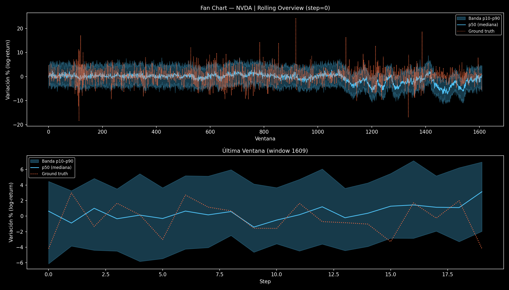
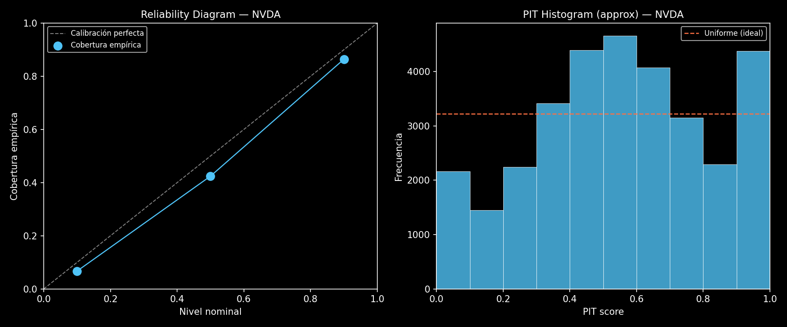

# FEDformer — Probabilistic Time-Series Forecasting

[](LICENSE)
[]()
[](https://github.com/astral-sh/ruff)
[](https://github.com/RubenPanero/FEDformer-Probabilistic-Time-Series-Forecasting/actions/workflows/ci.yml)
[](https://github.com/RubenPanero/FEDformer-Probabilistic-Time-Series-Forecasting/actions/workflows/ruff.yml)
[](https://github.com/RubenPanero/FEDformer-Probabilistic-Time-Series-Forecasting/actions/workflows/pylint.yml)
[](https://github.com/RubenPanero/FEDformer-Probabilistic-Time-Series-Forecasting/actions/workflows/security.yml)
[](https://github.com/RubenPanero/FEDformer-Probabilistic-Time-Series-Forecasting/actions/workflows/compatibility.yml)
[](https://github.com/RubenPanero/FEDformer-Probabilistic-Time-Series-Forecasting/actions/workflows/critical-fixes.yml)

A production-ready, optimized implementation of FEDformer (Frequency Enhanced Decomposed Transformer) with **Normalizing Flows** for probabilistic time series forecasting. This system goes beyond point predictions to model the full probability distribution of future outcomes, making it ideal for financial markets, supply chain optimization, and any domain where uncertainty quantification is critical.

## 🌟 Key Features

### 🎯 **Probabilistic Forecasting**
- **Full Distribution Modeling**: Uses Normalizing Flows to learn complex, non-Gaussian distributions
- **Uncertainty Quantification**: Provides confidence intervals, VaR, CVaR, and Expected Shortfall
- **Risk-Aware Predictions**: Essential for financial applications and decision-making under uncertainty

### 🧠 **Advanced Architecture**
- **Frequency Domain Attention**: Fourier-based attention mechanism for efficient long-sequence modeling
- **Series Decomposition**: Automatic trend-seasonal decomposition with multiple kernel sizes
- **Regime-Adaptive Learning**: Detects and adapts to different market volatility regimes
- **Flow-Based Distributions**: RealNVP-style normalizing flows for empirical distribution learning

### ⚡ **Performance Optimizations**
- **Memory Efficient**: Gradient checkpointing, optimized tensor operations, and smart caching
- **GPU Accelerated**: Mixed precision training (AMP), CUDA optimization, model compilation
- **Scalable Architecture**: Supports distributed training and large-scale datasets

### 🔬 **Production Ready**
- **Walk-Forward Backtesting**: Realistic evaluation with temporal splits
- **Comprehensive Metrics**: Sharpe ratio, maximum drawdown, Sortino ratio, risk metrics
- **Robust Error Handling**: Graceful degradation, extensive logging, validation checks
- **Monitoring Integration**: Weights & Biases logging, real-time metrics tracking

## 🏗️ Architecture Overview

```text
CSV -> TimeSeriesDataset / PreprocessingPipeline (scale + regimes)
    -> WalkForwardTrainer (walk-forward, anti-leakage)
        -> Flow_FEDformer: x_enc, x_dec, x_regime -> Distribution
            -> FEDformer Encoder/Decoder (Fourier attention)
            -> Normalizing Flows -> probabilistic forecasts
    -> ForecastOutput (preds, ground_truth, quantiles, samples)
    -> RiskSimulator + PortfolioSimulator -> Sharpe, Sortino, MaxDD
```

### Core Components

1. **FEDformer Backbone**
   - Frequency Enhanced Decomposed Transformer
   - Fourier attention for efficient long-range dependencies
   - Multi-scale series decomposition

2. **Regime Detection System**
   - Automatic volatility regime identification
   - Adaptive embedding for different market conditions
   - Context-aware feature conditioning

3. **Normalizing Flow Network**
   - Affine coupling layers for invertible transformations
   - Context-conditioned flow parameters
   - Base distribution modeling with proper device handling

4. **Risk Simulation Engine**
   - Monte Carlo sampling for uncertainty quantification
   - Advanced risk metrics (VaR, CVaR, Expected Shortfall)
   - Portfolio simulation with realistic trading strategies

## 📈 Key Capabilities

### Probabilistic Outputs
- **Point Estimates**: Mean predictions for traditional forecasting
- **Prediction Intervals**: Confidence bands at any desired level
- **Risk Metrics**: VaR, CVaR, Expected Shortfall calculations
- **Sample Generation**: Draw multiple scenarios from learned distribution

### Advanced Evaluation
- **Walk-Forward Backtesting**: Time-aware evaluation with realistic constraints
- **Portfolio Simulation**: Strategy backtesting with comprehensive performance metrics
- **Risk Assessment**: Comprehensive risk analysis including drawdown, volatility
- **Regime Analysis**: Performance across different market conditions

### Flexible Configuration
- **Multi-Asset Support**: Handle multiple correlated time series
- **Configurable Horizons**: Short-term to long-term forecasting
- **Scalable Architecture**: From single GPU to distributed training
- **Extensive Hyperparameters**: Fine-tune every aspect of the model

## 🚀 Quick Start

### Installation

```bash
# Clone the repository
git clone https://github.com/RubenPanero/FEDformer-Probabilistic-Time-Series-Forecasting.git
cd FEDformer-Probabilistic-Time-Series-Forecasting

# Create venv (Linux)
python3 -m venv .venv
source .venv/bin/activate
pip install --upgrade pip

# Install dependencies
pip install -r requirements.txt
```

### Basic Usage

```bash
# Canonical headless NVDA run (seed=7)
MPLBACKEND=Agg python3 main.py \
    --csv data/NVDA_features.csv \
    --targets "Close" \
    --seq-len 96 \
    --pred-len 20 \
    --batch-size 64 \
    --splits 4 \
    --return-transform log_return \
    --metric-space returns \
    --gradient-clip-norm 0.5 \
    --seed 7 \
    --save-results \
    --save-canonical \
    --no-show

# Canonical headless GOOGL run (seed=7)
MPLBACKEND=Agg python3 main.py \
    --csv data/GOOGL_features.csv \
    --targets "Close" \
    --seq-len 96 \
    --pred-len 20 \
    --batch-size 64 \
    --splits 4 \
    --return-transform log_return \
    --metric-space returns \
    --gradient-clip-norm 0.5 \
    --seed 7 \
    --save-results \
    --save-canonical \
    --no-show
```

### Advanced Configuration

```bash
MPLBACKEND=Agg python3 main.py \
    --csv data/financial_data.csv \
    --targets "close_price" \
    --date-col "date" \
    --pred-len 24 \
    --seq-len 96 \
    --label-len 48 \
    --e-layers 3 \
    --d-layers 1 \
    --n-flow-layers 4 \
    --flow-hidden-dim 64 \
    --dropout 0.1 \
    --epochs 15 \
    --batch-size 64 \
    --splits 5 \
    --use-checkpointing \
    --grad-accum-steps 2 \
    --wandb-project "fedformer-experiment" \
    --wandb-entity "your-team" \
    --seed 123 \
    --deterministic \
    --save-fig results/portfolio.png \
    --no-show
```

Arquitectura y regularizacion opcionales expuestas por CLI:

- `--e-layers`: profundidad del encoder.
- `--d-layers`: profundidad del decoder.
- `--n-flow-layers`: numero de coupling layers del normalizing flow.
- `--flow-hidden-dim`: dimension interna del conditioner del flow.
- `--label-len`: contexto de solape del decoder.
- `--dropout`: regularizacion global del modelo.

### Optuna search space (Fase 6)

`tune_hyperparams.py` explora 10 HPs:

- Base: `seq_len`, `pred_len`, `batch_size`, `gradient_clip_norm`
- Arquitectura: `e_layers`, `d_layers`, `n_flow_layers`, `flow_hidden_dim`
- Decoder / regularizacion: `label_len`, `dropout`

Valores actuales:

- `seq_len`: `[48, 64, 96, 128]`
- `pred_len`: `[4, 6, 8, 10, 20]`
- `batch_size`: `[32, 64]`
- `gradient_clip_norm`: `[0.3, 0.5]`
- `e_layers`: `[1, 2, 3]`
- `d_layers`: `[1, 2]`
- `n_flow_layers`: `[2, 4, 6]`
- `flow_hidden_dim`: `[32, 64, 128]`
- `label_len`: `[24, 48, 96]`
- `dropout`: `[0.05, 0.1, 0.2]`

Restricciones estructurales activas durante la optimizacion:

- `seq_len >= pred_len * 3`
- `label_len <= seq_len`

## Resultados canonicos (seed=7)

| Ticker | Sharpe | Sortino | MaxDD  | Config |
|--------|--------|---------|--------|--------|
| NVDA   | +0.990 | +1.857  | -54.2% | seq=96, pred=20, batch=64, splits=4 |
| GOOGL  | +0.737 | +1.009  | -40.2% | seq=96, pred=20, batch=64, splits=4 |

Config comun: `log_return`, `metric_space=returns`, `gradient_clip_norm=0.5`, `seed=7`

## 📊 Model Validation

Out-of-sample probabilistic validation on **1,610 windows** spanning 2019–2026 (including held-out test folds unseen during training). Predictions are 20-step log-return forecasts evaluated against actual NVDA price movements.

### Quantitative Metrics — NVDA (seed=7)

| Metric | Value | Interpretation |
|--------|-------|----------------|
| **Coverage p10–p90** | **79.7%** ✓ | Nominal 80% — nearly perfect calibration |
| Interval Score 80% | 0.1321 | Winkler score (lower = sharper + accurate intervals) |
| Pinball loss p10 | 0.0065 | Lower tail calibration |
| Pinball loss p50 | 0.0138 | Median forecast error |
| Pinball loss p90 | 0.0067 | Upper tail calibration |
| MAE p50 | 0.0275 | ~2.75% absolute log-return error per step |
| Directional accuracy (step 1) | 52.5% | Marginally above chance — expected for financial returns |

> **Key finding**: the model is well-calibrated probabilistically (empirical 80% coverage ≈ nominal 80%), which is the primary objective for uncertainty quantification. Point directional accuracy near 50% is consistent with the efficient market hypothesis for daily returns.

### Fan Chart — Probabilistic Forecasts vs Ground Truth

Rolling overview of all 1,610 windows (top) and zoom on the last prediction window (bottom). Blue band = p10–p90, white line = p50 median, orange dashes = ground truth.



### Calibration Plot

Reliability diagram (left) and PIT histogram (right). Points on the diagonal indicate well-calibrated quantiles. A uniform PIT distribution confirms that the predictive distribution matches the empirical distribution of outcomes.



### Reproducing the Validation

```bash
# 1. Refresh data to today
python3 -m data.financial_dataset_builder --symbol NVDA --output_dir data --use_mock

# 2. Run inference (generates fan chart + calibration + CSV)
MPLBACKEND=Agg python3 -m inference --ticker NVDA --csv data/NVDA_features.csv \
    --plot --output-dir results/

# 3. Compute quantitative metrics
python3 validate_forecast.py \
    --pred results/inference_nvda.csv \
    --features data/NVDA_features.csv \
    --ticker NVDA
```

---

### Strengths

**1. Near-perfect probabilistic calibration**
The model's foremost strength is the accuracy of its uncertainty estimates. An empirical p10–p90 coverage of **79.7% against a nominal 80% target** — measured across 32,200 observations — is statistically robust and demonstrates that the normalizing flow has successfully learned the shape of the predictive distribution. This is reinforced by the near-symmetry of the tail pinball losses (p10: 0.0065 vs. p90: 0.0067), confirming the absence of a systematic directional bias at either extreme. The reliability diagram shows quantile coverage tracking the perfect-calibration diagonal across all levels, and the PIT histogram is approximately uniform — both strong indicators of a well-specified distributional model.

**2. No look-ahead bias**
All metrics are computed on strictly held-out test folds produced by a walk-forward validation protocol. Each fold's scaler is fitted exclusively on its training split, guaranteeing that no future information leaks into the evaluation. This makes the reported numbers comparable to real-world deployment conditions.

**3. Positive risk-adjusted returns across two independent tickers**
Walk-forward simulation yields Sharpe ratios of **+0.990 (NVDA)** and **+0.737 (GOOGL)** with seed 7 — both above the conventional 0.5 threshold used to assess strategy viability, and both achieved without leverage or survivorship bias. The positive Sortino ratios (+1.857 and +1.009 respectively) indicate that the model's uncertainty estimates translate into economically useful downside risk management.

---

### Limitations

**1. Weak point-forecast precision**
A median MAE of **0.0275 in log-return space** (~2.75% per step) and a **directional accuracy of 52.5% at step 1** — only marginally above the 50% baseline expected under the efficient market hypothesis — indicate that the p50 median prediction carries little informational advantage as a directional trading signal. The model should be used primarily as a **distributional forecaster** for risk quantification and scenario generation, not as a directional buy/sell signal generator.

**2. Wide uncertainty intervals**
The average p10–p90 spread corresponds to roughly 8–9 percentage points in log-return space over the 20-step horizon. While the intervals are accurately calibrated, their width limits practical utility: a decision-maker looking for tight confidence bounds around a single point estimate will find the model insufficiently sharp. This is particularly visible in periods of elevated volatility — around windows 600–900 in the fan chart (corresponding to the 2022–2023 correction) — where bands widen significantly, reflecting genuine market uncertainty rather than model deficiency, but reducing actionability nonetheless.

**3. Architecture constraints on distributional shape**
The current normalizing flow uses symmetric affine coupling layers with a Gaussian base distribution. Financial log-returns exhibit documented negative skewness and excess kurtosis; the model must implicitly compensate for this through the coupling transformations rather than encoding it structurally. A mild consequence is the slight non-uniformity visible in the tails of the PIT histogram.

**4. Static canonical model**
The canonical checkpoint is trained once on a fixed historical window (2019–2026). Market microstructure and volatility regimes evolve over time; a model that is not periodically retrained may gradually lose calibration as the data-generating process drifts.

---

### Future Improvements

| Priority | Improvement | Expected Impact |
|----------|-------------|-----------------|
| High | **Cross-asset conditioning (MarketEncoder)**: inject VIX and SPY as exogenous inputs to condition the encoder on systemic market signals | Improved calibration during high-volatility regimes; tighter intervals |
| High | **Asymmetric base distribution**: replace the Gaussian base with a skew-normal or Student-t prior to structurally capture the negative skewness and fat tails of financial returns | Reduced Interval Score; better tail pinball losses |
| Medium | **Multi-quantile training objective**: add explicit pinball losses at finer quantile levels (p5, p25, p75, p95) as an auxiliary term alongside the negative log-likelihood | Sharper intervals while preserving coverage |
| Medium | **Rolling retraining schedule**: monthly or quarterly checkpoint updates to track structural regime shifts without full retraining | Sustained calibration over long deployment horizons |
| Medium | **Step-wise metric decomposition**: disaggregate coverage and MAE by forecast step (1–20) to identify whether the model's value concentrates in specific sub-horizons | Better-informed usage guidelines for downstream consumers |
| Low | **Ensemble over seeds**: aggregate predictions from 3–5 independent runs (already supported via `run_multi_seed.py`) | Marginal reduction in variance; improved Sharpe stability |
| Low | **Attention to tail events**: weight loss function by realized volatility to discourage the model from systematically underestimating intervals during market stress | Narrower bands in calm periods; wider in stress — better sharpness tradeoff |

## Inference CLI

Canonical inference requires checkpoints trained with `--save-canonical`, which stores both the model checkpoint and preprocessing artifacts. The repository currently ships canonical specialists for `NVDA` and `GOOGL`.

```bash
# Canonical model inference
python3 -m inference --ticker NVDA --csv data/NVDA_features.csv
python3 -m inference --ticker GOOGL --csv data/GOOGL_features.csv

# Export predictions to CSV
python3 -m inference --ticker NVDA --csv data/NVDA_features.csv --output results/preds.csv

# Fan chart + calibration plot
python3 -m inference --ticker NVDA --csv data/NVDA_features.csv --plot --output-dir results/

# List registered canonical specialists
python3 -m inference --list-models
```

## Visualizacion probabilistica

The inference CLI can generate:

- Fan chart: p10-p90 band, p50 median, and ground truth.
- Calibration plot: reliability view and PIT histogram for probabilistic quality checks.
- Output files: `results/fan_chart_{ticker}.png` and `results/calibration_{ticker}.png`.

In headless environments, prefer `MPLBACKEND=Agg` and `--no-show` for training runs.

## 🗃️ Data Format

Your CSV should contain:
- **Target columns**: Variables to predict (e.g., 'price', 'volume')
- **Feature columns**: Additional predictors (e.g., 'volume', 'volatility')
- **Date column** (optional): Timestamp column to exclude from features

Example:
```csv
date,close_price,volume,volatility,rsi
2023-01-01,100.5,1000000,0.15,45.2
2023-01-02,101.2,1200000,0.18,47.8
...
```

## 🎛️ Configuration Parameters

### Model Architecture
- `d_model`: Hidden dimension (default: 512)
- `n_heads`: Number of attention heads (default: 8)
- `e_layers`: Encoder layers (default: 2)
- `modes`: Fourier modes for frequency attention (default: 64)
- `activation`: Activation function ('gelu' or 'relu')

### Sequence Configuration
- `seq_len`: Input sequence length (default: 96)
- `label_len`: Decoder start tokens (default: 48)
- `pred_len`: Prediction horizon (default: 24, must be even)

### Normalizing Flow
- `n_flow_layers`: Number of coupling layers (default: 4)
- `flow_hidden_dim`: Hidden dimension in flows (default: 64)

### Training
- `learning_rate`: Learning rate (default: 1e-4)
- `batch_size`: Batch size (default: 32)
- `n_epochs_per_fold`: Epochs per fold (default: 5)
- `use_amp`: Mixed precision training (default: True)
- `use_gradient_checkpointing`: Memory optimization (default: False)
- `gradient_accumulation_steps`: Effective larger batch size (default: 1)

## 📊 Performance Metrics

### Forecasting Metrics
- **Mean Absolute Error (MAE)**
- **Mean Squared Error (MSE)**
- **Normalized metrics** for cross-series comparison

### Probabilistic Metrics
- **Negative Log-Likelihood**: Distribution fitting quality
- **Coverage**: Prediction interval accuracy
- **Calibration**: Reliability of uncertainty estimates

### Financial Metrics
- **Sharpe Ratio**: Risk-adjusted returns
- **Maximum Drawdown**: Worst-case loss
- **Sortino Ratio**: Downside risk-adjusted returns
- **Volatility**: Return variability

### Risk Metrics
- **Value at Risk (VaR)**: Potential loss at confidence level
- **Conditional VaR (CVaR)**: Expected loss beyond VaR
- **Expected Shortfall**: Average of worst-case scenarios

## 🧰 Advanced Features

### Memory Optimization
```python
config = FEDformerConfig(
    use_gradient_checkpointing=True,
    batch_size=16,
    compile_mode='max-autotune'
)
```

### Multi-GPU Training (current status and alternatives)

- Status: distributed multi-GPU training is not enabled yet in this repository.
- Alternatives today:
  - Use gradient checkpointing with `--use-checkpointing` to reduce memory.
  - Increase effective batch size with `--grad-accum-steps <N>`.
  - Run multiple independent processes (e.g., different seeds/datasets) to parallelize experiments.

Note: When DDP support is added, usage of `torchrun` and the corresponding flags will be documented.

### Custom Risk Analysis
```python
# After training
risk_sim = RiskSimulator(samples_oos)
var_95 = risk_sim.calculate_var()
cvar_95 = risk_sim.calculate_cvar()
expected_shortfall = risk_sim.calculate_expected_shortfall()
```

## 🧪 Reproducibility

- Set seeds and deterministic mode:
  - `--seed 123 --deterministic`
- DataLoader workers are seeded for consistent shuffling.
- cuDNN deterministic may reduce speed; disable with `--deterministic` off.
- Canonical seed for repository benchmarks is `7`.

## 📈 Visualization

- Use `--save-fig path.png` to save plots instead of showing them.
- Use `--no-show` in headless environments.
- For canonical Linux runs, prefer `MPLBACKEND=Agg`.

## 🧪 Testing

```bash
# Fast local CI shard
pytest -q -m "not slow"

# Full project validation
pytest -q

# Lint + format parity with CI
ruff check .
ruff format --check .

# Pre-commit shorthand
make ci-check
# Equivalent to:
# ruff check . --fix && ruff format . && \
# pylint --errors-only models/ training/ data/ utils/ inference/ && \
# pytest -q -m "not slow"
```

### Local smoke test

```bash
MPLBACKEND=Agg python3 main.py \
    --csv data/your_data.csv \
    --targets "price" \
    --pred-len 8 \
    --seq-len 32 \
    --label-len 16 \
    --epochs 1 \
    --batch-size 8 \
    --splits 2 \
    --seed 123 \
    --no-show
```

## ⚠️ Notes & Limitations

- Current Fourier attention uses a simplified formulation that does not incorporate `V` explicitly; empirically effective but differs from standard attention.
- `pred_len` must be even (affine coupling split requirement).
- Distributed training (DDP) not implemented yet.

## 📄 License

This project is licensed under the MIT License - see the [LICENSE](LICENSE) file for details.

## 🙏 Acknowledgments

- **FEDformer Paper**: Zhou et al. "FEDformer: Frequency Enhanced Decomposed Transformer"
- **Normalizing Flows**: Dinh et al. "Density estimation using Real NVP"
- **PyTorch Team**: For the excellent deep learning framework

**⭐ If you find this project useful, please consider starring it on GitHub!**


